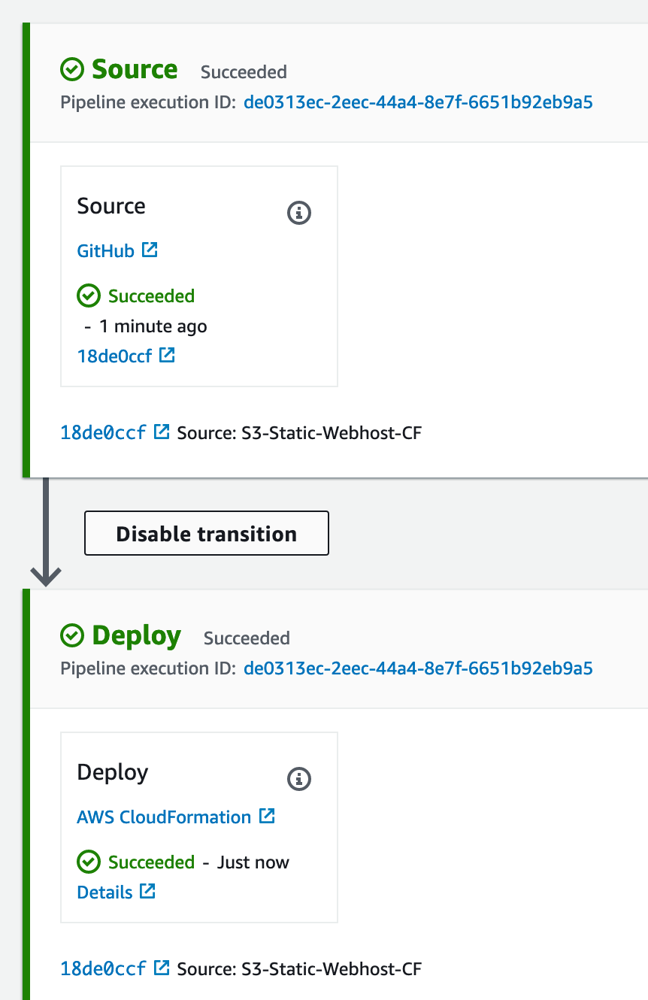

## Cloudformation-with-Codepipeline-Demo
----
:rocket: :rocket: :rocket:

In this tutorial, I will demonstrate to create AWS CloudFormation template stack automatically deploy with AWS CodePipeline.

When we update the CloudFormation template stacks according to infrastructure changes and push to Github (or) AWS CodeCommit repository then automatically triggered with code pipeline for deployment to AWS infrastructure.

The overview workflow are as follow,

``` 
    1.CloudFormation Template 
    2.Github (Store/Push Cloudformation Template)  
    3.CodePipeline (Create Deployment Pipeline)
```

CodePipeline's pipeline result looks like:




:pencil: :pencil: :pencil:

Stay tuned at AWS User Group Myanmar Blog. ***https://blog.awsugmm.org***

```
 References: 

 https://aws.amazon.com/about-aws/whats-new/2016/11/aws-codepipeline-introduces-aws-cloudformation-deployment-action/
 https://docs.aws.amazon.com/AWSCloudFormation/latest/UserGuide/Welcome.html
 https://docs.aws.amazon.com/codepipeline/latest/userguide/welcome.html
```
----
